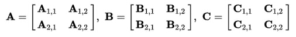
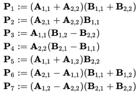
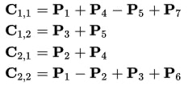

# Installation OpenMP guide for MacOS with Apple Silicon processors
On macOS 13.2.1 and up-to-date Xcode command line toolset, on Apple Silicon (M1,M2 and etc) chip I'm able to use OpenMP based on libomp from Homebrew (brew install libomp) BUT with the Apple provided clang, by running:

```
brew install libomp
```

>libomp is keg-only, which means it was not symlinked into /opt/homebrew, <br/>
because it can override GCC headers and result in broken builds.

>For compilers to find libomp you may need to set: <br/>
    export LDFLAGS="-L/opt/homebrew/opt/libomp/lib" <br/>
    export CPPFLAGS="-I/opt/homebrew/opt/libomp/include" <br/>


```
clang -Xclang -fopenmp -L/opt/homebrew/opt/libomp/lib -I/opt/homebrew/opt/libomp/include -lomp file_name.c -o file_name 
```


## Strassen algorithm

Пусть A и B — две (n * n)-матрицы, причём n — степень числа 2. Тогда можно разбить каждую матрицу A и B на четыре ((n/2)*(n/2))-матрицы и через них выразить произведение матриц A и B:



Определим новые элементы:



Таким образом, нам нужно всего 7 умножений на каждом этапе рекурсии. Элементы матрицы C выражаются из Pk по формулам:



Рекурсивный процесс продолжается n раз, до тех пор пока размер матриц Ci,j не станет достаточно малым, далее используют обычный метод умножения матриц. Это делают из-за того, что алгоритм Штрассена теряет эффективность по сравнению с обычным на малых матрицах в силу большего числа сложений.
